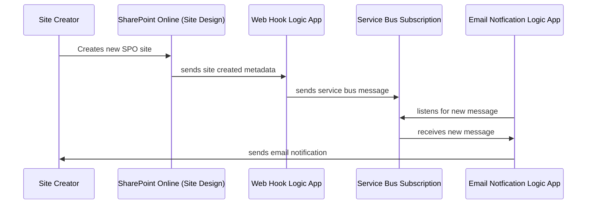

# New SharePoint Online Site Creation Email Notice 

## Process Flow

### Owner Notifcation Process Flow

## Artifact Overview
Overview of all the components in the bicep template.

    <kbd></kbd> 

## Access Control (IAM)
The two Azure Logic apps delievered with this solution have system assigned managed identities enabled.  Becuase these apps need to read/write 
messsages in Service Bus, the corresponding service principals ar granted the *Azure Service Bus Data Owner* role at the resource group scope.

    <kbd></kbd> 

Bicep tempate: <a href="/modules/roleassignments.bicep">roleassignments.bicep</a>

## Service Bus
### Service Bus Namespace
A standard SKU Service Bus namespace is created.  The namespace is configured to enfore TLS 1.2.  Local auth (SAS Key Authentication) is disabled since the Logic Apps use their service principal for message access.  

Bicep tempate: <a href="/modules/servicebus.bicep">servicebus.bicep</a>

### Service Bus Topic
A single Topic (spo-site-creation) is created in the Service Bus namespace.  This topic will receive all messages from the Logic App webhook. 

Bicep tempate: <a href="/modules/servicebus-topic.bicep">servicebus-topic.bicep</a>

### Service Bus Subscription
A single subscription (new-site-email-notice) is created in the Service Bus Topic.  This subscrption has no filters and receive all messages. 

Bicep tempate: <a href="/modules/servicebus-topic-subscription.bicep">servicebus-topic-subscription.bicep</a>

## Webhook Logic App
Logic App Workflow acts as a webhook endpoint which receives an HTTP POST request from SharePoint Online when any site is provisioned. The sites's metadata (Url, Title, Creator Name, Creator Email, GroupId, WebTemplate) is included in the POST body data from SharePoint Online. The site's metadata is then send as a new message to in the *new-site-email-notice* in the Topic Subscription. 

Bicep tempate: <a href="/modules/logicapp-webhook.bicep">logicapp-webhook.bicep</a>

    <kbd></kbd> 

## Email Notification Logic App
This Azure Logic App polls the Service Bus subscription every 1 minute for new messages.  When a new message is found, the Logic App sends a
templated email to the site's creator. 

Bicep tempate: <a href="/modules/logicapp-emailnotification.bicep">logicapp-emailnotification.bicep</a>

    <kbd></kbd>

## API Connections
The two API connections included in the solution are leveraged by the Logic Apps to access the Service Bus and the Office365 Shared Mailbox.

Bicep tempate: <a href="/modules/connection-office365.bicep">connection-office365.bicep</a>

Bicep tempate: <a href="/modules/connection-servicebus.bicep">connection-servicebus.bicep</a>

